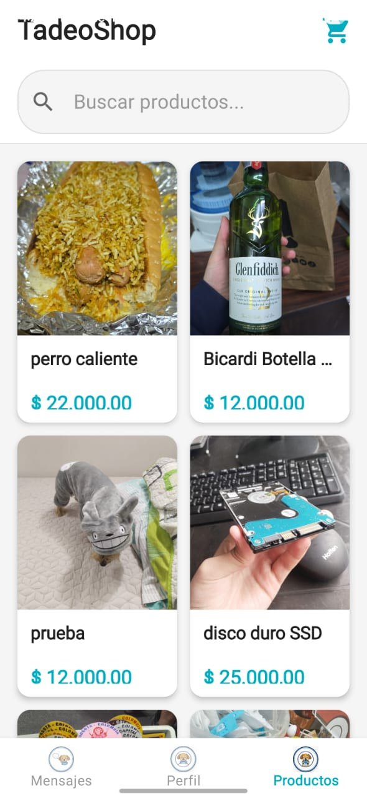
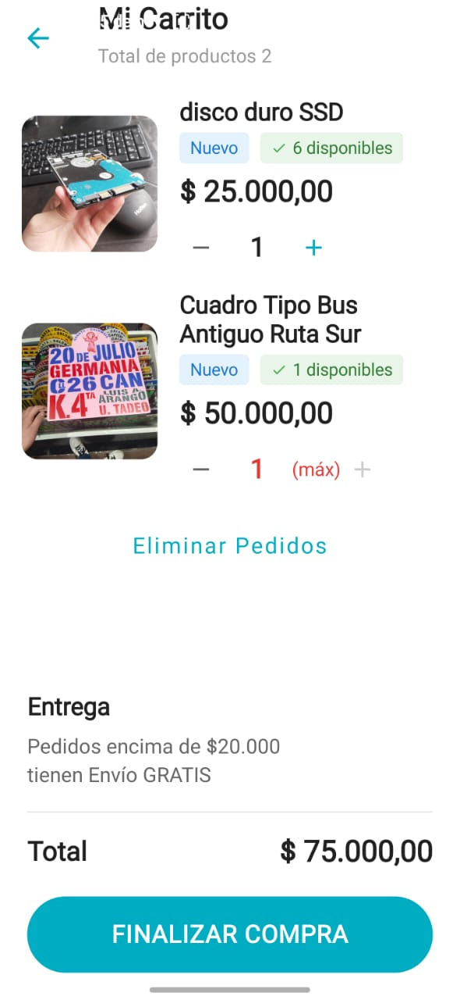
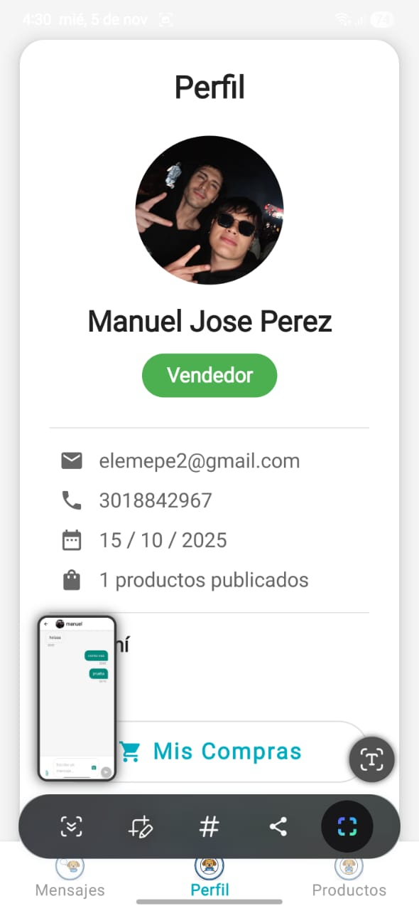
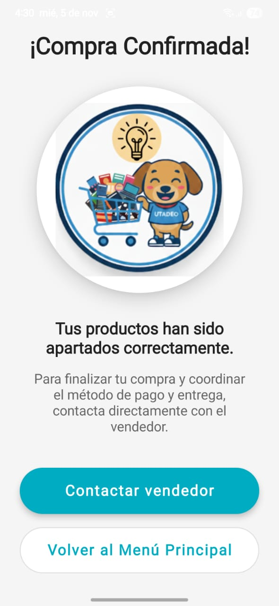

#  TadeoShop


##  ¿Qué es TadeoShop?

**TadeoShop** es un marketplace universitario donde puedes comprar y vender productos dentro de tu comunidad académica de forma fácil y segura.

**Perfecto para:**
-  Vender libros y materiales de estudio
-  Comprar/vender tecnología
-  Intercambiar ropa y accesorios
-  Encontrar artículos de entretenimiento
- Y mucho más...

## ✨ ¿Qué puedo hacer con la app?

### Si eres Comprador 
- Explora productos disponibles en tu universidad
- Agrega productos a tu carrito de compras
- Chatea directamente con los vendedores
- Consulta tu historial de compras
- Personaliza tu perfil

### Si eres Vendedor 
- Publica tus productos con fotos y descripciones
- Gestiona tu inventario fácilmente
- Revisa tu historial de ventas
- Chatea con compradores interesados
- Todo lo que puede hacer un comprador, ¡y más!

##  ¿Cómo instalo la app?

### Opción 1: Descargar APK (Más Fácil)

1. Ve a la sección [Releases](https://github.com/Hakuz001/TadeoShopapp/releases) de este repositorio
2. Descarga el archivo `TadeoShop.apk` de la versión más reciente
3. Abre el archivo en tu teléfono Android
4. Si es la primera vez, permite instalar aplicaciones de fuentes desconocidas
5. Instala la app
6. ¡Listo! Abre TadeoShop y regístrate

### Opción 2: Compilar desde el código fuente

**Requisitos:**
- Android Studio instalado
- Teléfono o emulador Android

**Pasos:**

1. **Descarga el código**
   ```bash
   git clone https://github.com/Hakuz001/TadeoShopapp.git
   ```

2. **Abre el proyecto en Android Studio**
    - File → Open → Selecciona la carpeta TadeoShopapp

3. **Espera a que sincronice**
    - Android Studio descargará las dependencias automáticamente

4. **Conecta tu teléfono o inicia un emulador**

5. **Da click en el botón Run ▶️**

6. **¡Listo!** La app se instalará en tu dispositivo

##  Requisitos del Dispositivo

- Android 7.0 (Nougat) o superior
- Conexión a Internet
- Al menos 50 MB de espacio libre

##  Tecnologías

- Lenguaje: **Kotlin**
- Framework UI: **Jetpack Compose**
- Base de datos: **Firebase**


##  Capturas de Pantalla

### Pantalla de Login


### Marketplace


### Carrito de Compras


### Chat/Mensajería


### Perfil de Usuario


### Compra Confirmada


## ❓ Preguntas Frecuentes

**¿Es gratis?**
Sí, TadeoShop es completamente gratuita.

**¿Necesito crear una cuenta?**
Sí, necesitas registrarte para usar la aplicación y garantizar la seguridad de las transacciones.

**¿Cómo contacto a un vendedor?**
Una vez que encuentres un producto que te interese, puedes chatear directamente con el vendedor desde la aplicación.

**¿Puedo ser vendedor y comprador al mismo tiempo?**
¡Por supuesto! Puedes cambiar entre ambos roles según lo necesites.

**¿La app procesa pagos?**
No, los pagos se coordinan directamente entre comprador y vendedor a través del chat.

##  Seguridad

- Todos los usuarios deben registrarse con email verificado
- Los chats son privados entre comprador y vendedor
- Reporta cualquier comportamiento sospechoso

##  Rama con Versión Funcional

**Rama principal**: `main`

Esta es la rama que contiene la versión estable y completamente funcional de la aplicación.

##  Desarrollador

**Manuel Jose Perez, Alejandro Villamizar, Juan Pablo Martinez**
- GitHub: [@Hakuz001](https://github.com/Hakuz001)
- Email: manuel.perez.32@hotmail.com

##  Licencia    

Proyecto académico desarrollado para la clase de construccion de aplicaciones moviles

---

